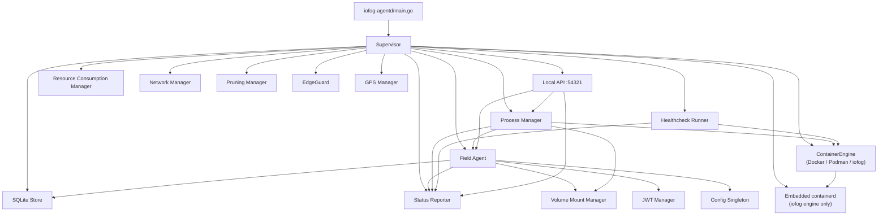
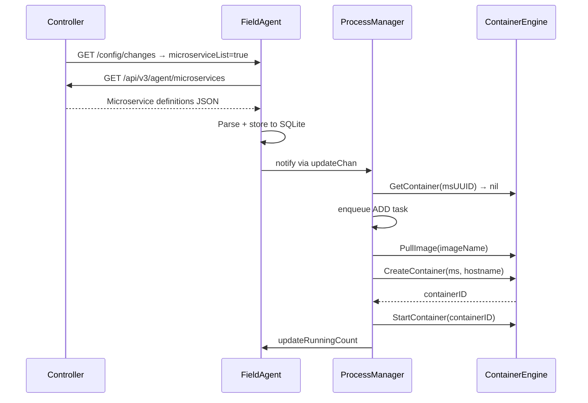

# ioFog Agent Architecture

## Overview

The ioFog Agent (`iofog-agentd`) is a Go binary that runs on edge devices. It maintains a bidirectional relationship with the ioFog Controller: it receives desired state (microservice definitions, volume mounts, registries) from the controller, reconciles that state against the running container engine, and reports back agent and container health. All container management is abstracted behind a `ContainerEngine` interface, enabling the same agent binary to drive Docker, Podman, or an in-process embedded containerd instance.

---

## Top-Level Directory Layout

```
agent-go/
├── cmd/
│   ├── iofog-agent/         # CLI binary (provision, deprovision, config, status)
│   └── iofog-agentd/        # Daemon binary — entry point
├── internal/                # Application-private packages
│   ├── auth/                # JWT signing (RS256) for controller API authentication
│   ├── config/              # Singleton Config; YAML load/save; SIGHUP reload
│   ├── constants/           # Engine names, containerd namespace/path constants
│   ├── diagnostics/         # strace monitoring, image snapshot upload
│   ├── edgeguard/           # Hardware threshold monitor (disk, memory)
│   ├── embedded/            # Extracts runc, shim, CNI plugins, pause.tar.gz from binary
│   ├── engines/             # Factory: ContainerEngine from config string
│   ├── fieldagent/          # Controller communication, microservice sync, exec sessions
│   ├── gps/                 # GPS polling (NMEA device or manual coordinates)
│   ├── hardware/            # Hardware signature file management
│   ├── healthcheck/         # Exec-based healthcheck runner (iofog engine only)
│   ├── localapi/            # HTTP/WebSocket server on :54321
│   ├── models/              # Pure data types (Microservice, VolumeMapping, …)
│   ├── network/             # Current IP address resolution
│   ├── processmanager/      # Container reconciliation loop and task queue
│   ├── proxy/               # SSH reverse tunnel to controller
│   ├── pruning/             # Image pruning (schedule, disk threshold, controller request)
│   ├── resourceconsumption/ # CPU/memory/disk usage polling and limit enforcement
│   ├── resourcemanager/     # HAL hardware/USB info collection
│   ├── statusreporter/      # Central status aggregation (singleton)
│   ├── store/               # SQLite persistence (microservices, registries, volume mounts)
│   ├── supervisor/          # Root orchestrator — module start/stop order, watchdog
│   ├── utils/               # PID file, logging helpers, path constants
│   ├── version/             # Agent upgrade/rollback
│   └── volumemount/         # SECRET and CONFIGMAP volume lifecycle manager
└── pkg/                     # Potentially-reusable packages
    ├── containerd/          # In-process containerd service (plugins, config, socket)
    ├── docker/              # Docker client helpers
    └── engine/
        ├── engine.go        # ContainerEngine interface
        ├── docker/          # Docker implementation
        ├── iofog/           # CRI/containerd implementation
        └── podman/          # Podman implementation
```

---

## Module Dependency Graph



---

## Core Modules

### Supervisor (`internal/supervisor`)

The root orchestrator. It starts all modules in dependency order and shuts them down in reverse. It also runs a 5-second watchdog goroutine (iofog engine only) that health-checks the embedded containerd service and restarts it if unhealthy.

Start order:
1. SQLite store
2. Status Reporter, Network Manager
3. Resource Consumption Manager
4. Field Agent (loads initial desired state from SQLite / controller)
5. Embedded containerd + engine init (iofog) or Docker/Podman client init
6. Process Manager, Healthcheck Runner
7. Back-wire Field Agent → Process Manager reference
8. Local API, Pruning, EdgeGuard, GPS, Proxy

---

### Field Agent (`internal/fieldagent`)

The controller-facing brain. Runs three background workers:

| Worker | Frequency | Purpose |
|--------|-----------|---------|
| `postStatusWorker` | `cfg.StatusFrequency` | `PUT /api/v3/agent/status` with aggregated status |
| `getChangesWorker` | `cfg.ChangeFrequency` | `GET /api/v3/agent/config/changes`; dispatches handlers |
| `postDiagnosticsWorker` | 10 s | Posts strace data (only when strace monitoring is configured) |

On each `getChangesWorker` cycle, the field agent checks a set of boolean change flags returned by the controller (`microserviceList`, `registries`, `volumeMounts`, `config`, `tunnel`, `version`, …). For each active flag it calls the corresponding loader:

- `loadMicroservices()` → parses and stores to SQLite → notifies Process Manager via `updateChan`
- `loadRegistries()` → engine login for private registries
- `loadVolumeMounts()` → VolumeMountManager.ProcessVolumeMountChanges()

The field agent also manages exec and log WebSocket sessions: when the controller indicates `execSessions=true`, it opens a WebSocket to the controller and relays I/O to the running container via `ProcessManager.CreateExecSession / StartExecSession`.

---

### Process Manager (`internal/processmanager`)

The container reconciler. Runs two goroutines:

**`containersMonitor()`** — periodic loop (default every 5 s, also woken by `updateChan`):
1. `handleLatestMicroservices()` — for each desired microservice, compare with actual container state:
   - Container missing → schedule `ADD` task
   - Container exists, `ms.Delete=true` → schedule `REMOVE` task
   - Container exists, running, `AreMicroserviceAndContainerEqual` returns false → schedule `UPDATE` task
   - Stuck in exit loop → mark `IsStuckInRestart`
2. `deleteRemainingMicroservices()` — removes containers whose UUIDs no longer appear in the desired state
3. `updateRunningMicroservicesCount()` — counts containers whose name starts with `iofog_`
4. `updateCurrentMicroservices()` — saves current set to SQLite

**`checkTasks()`** — drains the task queue:
- `TaskActionAdd` → `ContainerManager.AddContainer(ms)` → `createContainer()` → pull image → `engine.CreateContainer` → `engine.StartContainer`
- `TaskActionUpdate` → `ContainerManager.UpdateContainer(ms)` → pull new image → remove old container → create+start new
- `TaskActionRemove` / `TaskActionRemoveWithCleanup` → stop + remove container (+ image)
- Task retried up to 5 times on error; after 5 failures the `IsUpdating` lock is released so the next monitoring cycle can try again

`IsUpdating` (atomic bool on each `Microservice`) prevents the monitoring loop from enqueuing duplicate tasks while one is already in-flight.

---

### Container Engine Interface (`pkg/engine/engine.go`)

The single abstraction over all container runtimes:

```go
type ContainerEngine interface {
    Init(cfg EngineConfig) error
    GetContainer(microserviceUUID string) (*Container, error)
    GetRunningContainers() ([]Container, error)
    GetAllContainers() ([]Container, error)
    CreateContainer(ms *models.Microservice, hostname string) (string, error)
    StartContainer(containerID string) error
    StopContainer(containerID string) error
    RemoveContainer(containerID string, withCleanup bool) error
    PullImage(imageName string, registry *models.Registry, auth *AuthConfig) error
    FindLocalImage(imageName string) (bool, error)
    RemoveImage(imageRef string) error
    GetContainerStatus(containerID, msUUID string) (*models.MicroserviceStatus, error)
    GetContainerStats(containerID string) (*ContainerStats, error)
    GetContainerIPAddress(containerID string) (string, error)
    GetContainerStartedAt(containerID string) (int64, error)
    TailContainerLogs(containerID string, n int) (string, error)
    AreMicroserviceAndContainerEqual(containerID string, ms *models.Microservice) bool
    EnsureNetwork(name string) error
    CreateExecSession(...) error
    StartExecSession(...) error
    GetContainerMicroserviceUUID(cont Container) string
    GetContainerName(cont Container) string
    Close() error
}
```

See [`docs/container_engine.md`](container_engine.md) for a detailed breakdown of each implementation.

---

### Volume Mount Manager (`internal/volumemount`)

Manages two controller-provisioned data types: **SECRETs** and **CONFIGMAPs**. Both are written to disk as atomic versioned directory trees (Kubernetes-style `..data` symlink pattern) so that all keys in a mount update simultaneously from the container's perspective.

**Directory structure:**
```
<diskDir>/volumes/secrets/<name>/
  ..data                        → symlink to versioned dir
  ..2026_03_12_10_30_00.123/    ← versioned directory (actual files)
  keyA                          → symlink to ..data/keyA
  keyB                          → symlink to ..data/keyB

<diskDir>/volumes/microservices/<msUUID>/<mountName>/
  (bind-mount-friendly copy of above, mode 0755/0644)
```

**Lifecycle:**
1. Field Agent calls `ProcessVolumeMountChanges(mounts)` on every `volumeMounts=true` change
2. New mount: create versioned dir + files + symlinks + per-microservice copy
3. Updated mount: checksum comparison; if changed, create new versioned dir, atomically update `..data` symlink
4. Deleted mount: remove directory tree; release SQLite record
5. On restart: `loadIndex()` reads SQLite, `rehydrateMainStructureFromRecord()` recreates any missing disk structures

**Deadlock safety:** Functions that update the index while already holding `indexLock` use the `*Unsafe` variant (e.g., `trackMicroserviceUsageUnsafe`) instead of the public locking wrappers, preventing reentrant-lock deadlocks.

---

### Healthcheck Runner (`internal/healthcheck`)

Only active when `containerEngine=iofog`. Docker and Podman engines support native OCI healthcheck specs and do not use this runner.

On each interval (`cfg.HealthcheckIntervalSeconds`, default 30 s):
1. `GetRunningContainers()` — lists running non-sandbox containers
2. For each container, reads `*models.Healthcheck` from the `iofog-healthcheck` container label (written at creation; survives restarts)
3. Skips containers still in `startPeriod`
4. Calls `ExecWithExitCode(containerID, cmd, timeout)` on the iofog engine
5. Tracks `consecutiveFailures`; after `hc.Retries` failures reports `"unhealthy"` to Status Reporter

Exec ID is capped to 12 chars of container ID + `-hc-` + base-36 nanosecond timestamp to stay within containerd's 76-character exec-ID limit.

---

### Local API (`internal/localapi`, port `:54321`)

HTTP server used by the CLI (`iofog-agent` binary) and by microservices running on the same host. Authentication uses the same RS256 JWT mechanism as the controller API, except that a few endpoints (config read, log post) are intentionally unauthenticated so containers can call them without credentials.

Key endpoints:

| Method | Path | Auth | Description |
|--------|------|------|-------------|
| GET | `/v2/status` | ✓ | Full daemon status (used by `iofog-agent status`) |
| GET | `/v2/info` | ✓ | Config report (network, limits) |
| GET | `/v2/version` | ✓ | Agent version string |
| POST | `/v2/provision` | ✓ | Provision with controller key |
| POST | `/v2/deprovision` | ✓ | Deprovision agent |
| GET | `/v2/config/get` | ✗ | Read current config (microservice-accessible) |
| POST | `/v2/config` | ✓ | Update config properties |
| POST | `/v2/log` | ✗ | Accept log lines from microservices |
| WS | `/v2/control/socket/id/:uuid` | — | Exec/log WebSocket relay |

---

### Status Reporter (`internal/statusreporter`)

A singleton, thread-safe status hub. Every module writes its status via `UpdateProcessManagerStatus`, `UpdateFieldAgentStatus`, etc. (functional update pattern: `fn(status *Status)`). The Field Agent reads the aggregated struct and serializes it to the controller in `PUT /api/v3/agent/status`.

---

### SQLite Store (`internal/store`)

The single persistence layer. Three tables:

| Table | Contents |
|-------|----------|
| `microservices` | Cached microservice JSON from last controller sync |
| `registries` | Registry credentials (URL, username, token, isPublic) |
| `volume_mounts` | Volume mount records (UUID, name, kind, version, checksum, data, microservice list) |

Schema migrations are versioned and applied idempotently on startup. On first startup after a Java-agent migration, legacy JSON cache files are imported into SQLite.

---

## Key Data Flow

### Microservice Deployment



### Configuration Drift Detection

Every 5 seconds, `containersMonitor()` calls `AreMicroserviceAndContainerEqual(containerID, ms)` for each running container. This compares:

1. Image name (from container metadata)
2. Environment variables (desired keys present in actual OCI spec env)
3. Port mappings — read from `iofog-ports` label (skipped for host-network containers where CRI ignores port bindings)
4. Network mode — read from `iofog-hostnet` label (`"true"` = host network; label-based to avoid CRI OCI spec path ambiguity)

Any mismatch schedules an `UPDATE` task which pulls the new image, removes the old container, and creates the replacement.

---

## Security

- **Controller authentication**: RS256 JWT tokens signed with the agent's provisioned private key. The key ID and public key are registered with the controller at provision time.
- **Local API authentication**: Same JWT mechanism; the CLI obtains a short-lived token by reading the private key from disk.
- **TLS**: Optional custom CA certificate for controller HTTPS connections (`ControllerCert` config).
- **Container isolation**: Containers run with the privileges specified by the controller (`IsPrivileged`, `CapAdd`, `CapDrop`, `RunAsUser`). The iofog engine writes AppArmor profiles via the containerd CRI plugin.

---

## Configuration

Configuration lives in `config.yaml` (default: `/etc/iofog-agent/config.yaml`). Key fields:

```yaml
# Identity (set after provisioning)
iofog_uuid: "..."
private_key: "..."      # RS256 PEM key for JWT signing
controller_url: "https://controller.example.com:51121"

# Engine selection
container_engine: "iofog"   # "docker" | "podman" | "iofog"

# Disk + log
disk_directory: "/var/lib/iofog-agent"
log_disk_directory: "/var/log/iofog-agent"
log_level: "INFO"

# Resource limits
disk_limit: 10          # GiB
memory_limit: 4096      # MiB
cpu_limit: 80           # %

# Polling frequencies (seconds)
status_frequency: 10
change_frequency: 10

# Router / NATS (populated by controller)
router_uuid: "..."
```

SIGHUP causes a hot config reload without restarting any modules.

---

## Deployment

The daemon is distributed as a single static binary (all containerd plugins and runc/shim binaries are embedded). It is typically deployed as a `systemd` service:

```
/usr/bin/iofog-agentd          # daemon
/usr/bin/iofog-agent           # CLI
/etc/iofog-agent/config.yaml   # configuration
/var/lib/iofog-agent/          # data (SQLite, volume mounts, messages)
/var/lib/iofog-agent-containerd/ # embedded containerd root + state
/run/iofog-agent/              # runtime (PID file, containerd socket, hosts files)
/var/log/iofog-agent/          # logs
```
