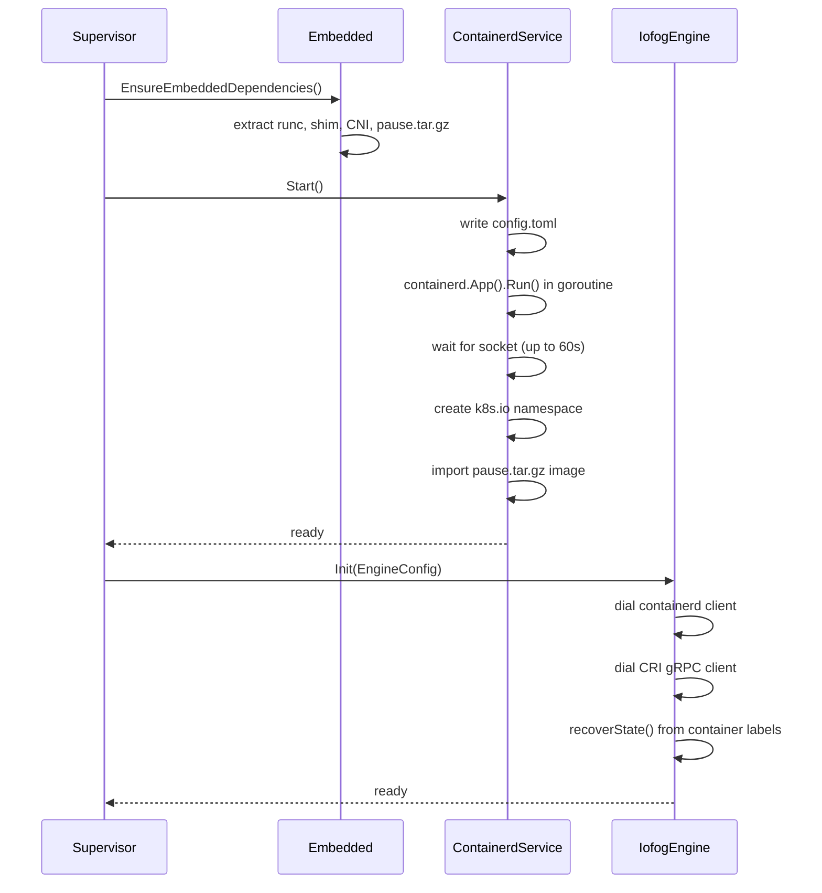
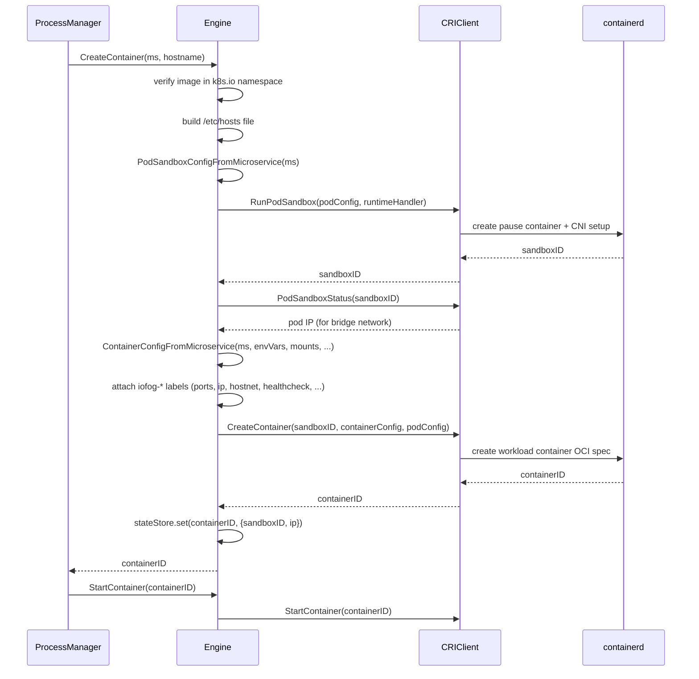

# Container Engine Design

## Overview

The ioFog Agent supports multiple container runtimes through a single `ContainerEngine` interface. The same process manager, reconciliation loop, and healthcheck runner work identically regardless of which engine is configured. The engine is selected at startup via `cfg.ContainerEngine` and cannot be changed without restarting the agent.

---

## The `ContainerEngine` Interface

**Location:** `pkg/engine/engine.go`

Every container runtime must implement this interface. It covers the full container lifecycle as well as image management, status querying, exec sessions, and drift detection.

```go
type ContainerEngine interface {
    // Lifecycle
    Init(cfg EngineConfig) error
    Close() error

    // Container queries
    GetContainer(microserviceUUID string) (*Container, error)
    GetRunningContainers() ([]Container, error)
    GetAllContainers() ([]Container, error)

    // Container operations
    CreateContainer(ms *models.Microservice, hostname string) (string, error)
    StartContainer(containerID string) error
    StopContainer(containerID string) error
    RemoveContainer(containerID string, withCleanup bool) error

    // Image management
    PullImage(imageName string, registry *models.Registry, auth *AuthConfig) error
    FindLocalImage(imageName string) (bool, error)
    RemoveImage(imageRef string) error
    ListImages() ([]Image, error)
    DeleteImage(imageRef string) error
    PruneDangling() error
    PruneImages(excludeImageNames []string) error

    // Status + metrics
    GetContainerStatus(containerID, msUUID string) (*models.MicroserviceStatus, error)
    GetContainerStats(containerID string) (*ContainerStats, error)
    GetContainerIPAddress(containerID string) (string, error)
    GetContainerStartedAt(containerID string) (int64, error)
    TailContainerLogs(containerID string, n int) (string, error)

    // Drift detection
    AreMicroserviceAndContainerEqual(containerID string, ms *models.Microservice) bool

    // Network
    EnsureNetwork(name string) error

    // Exec sessions (controller-driven interactive shells)
    CreateExecSession(containerID string, cmd []string, tty bool) (string, error)
    StartExecSession(execID string, stdin io.Reader, stdout, stderr io.Writer) error
    GetExecSessionStatus(execID string) (bool, error)
    StopExecSession(execID string) error

    // Helpers used by ProcessManager
    GetContainerMicroserviceUUID(cont Container) string
    GetContainerName(cont Container) string
}
```

Additionally, the iofog engine implements the optional `HealthcheckEngine` interface (`internal/healthcheck`):

```go
type HealthcheckEngine interface {
    ExecWithExitCode(containerID string, cmd []string, timeout time.Duration) (int, error)
}
```

Docker and Podman support native OCI `HEALTHCHECK` directives, so they do not implement this interface.

---

## Engine Selection

**Location:** `internal/engines/factory.go`

```go
func NewContainerEngine(engineType string) (engine.ContainerEngine, error) {
    switch engineType {
    case constants.DockerContainerEngine:
        return dockerengine.New(), nil
    case constants.PodmanContainerEngine:
        return podmanengine.New(), nil
    case constants.IofogContainerEngine:
        return iofogengine.New(cfg.LogDir), nil
    default:
        return nil, fmt.Errorf("unknown engine: %s", engineType)
    }
}
```

The engine is initialised with `engine.Init(EngineConfig{...})` which establishes the connection to the runtime (Docker socket, Podman socket, or the embedded containerd socket).

---

## Engine Comparison

| Feature | Docker (`docker`) | Podman (`podman`) | Embedded containerd (`iofog`) |
|---------|------------------|------------------|-------------------------------|
| Socket | `/var/run/docker.sock` | Podman socket | `/run/iofog-agent/containerd.sock` |
| External daemon required | Yes (dockerd) | Yes (podman service) | No — in-process |
| Network | Docker bridge | Podman network | CNI (`iofog0` bridge, `172.18.0.0/16`) |
| Image pull | Docker API | Docker-compatible API | containerd + CRI |
| Container model | Single container | Single container | CRI pod (pause sandbox + workload) |
| Port mappings | iptables / nftables | iptables / nftables | CNI portmap plugin |
| Native healthcheck | Yes (`HEALTHCHECK`) | Yes (`HEALTHCHECK`) | No — exec runner in agent |
| Exec sessions | Docker API | Docker-compatible | containerd `task.Exec()` |
| Host networking | `--network=host` | `--network=host` | `NamespaceMode_NODE` in CRI |
| WASM workloads | No | No | Yes (`containerd-shim-spin`) |
| Linux only | No (macOS supported) | No | Yes (`//go:build linux`) |

---

## Docker Engine (`pkg/engine/docker`)

Uses `github.com/docker/docker/client`. Container names are set to `iofog_<msUUID>` and used as the primary lookup key. All standard Docker capabilities are available: bind mounts, named volumes, port bindings, `--network=host`, exec.

**Drift detection** reads the running container's inspect data directly from the Docker API and compares image, env, ports, volumes, and network mode against the desired `Microservice` struct.

---

## Podman Engine (`pkg/engine/podman`)

Uses the same Docker-compatible SDK pointed at the Podman REST socket. Functionally equivalent to the Docker engine from the agent's perspective.

---

## Embedded Containerd Engine (`pkg/engine/iofog`)

This is the primary engine for production ioFog deployments. It embeds a full containerd instance directly into the agent binary — no external container daemon is required on the host.

### How Containerd Is Embedded

```
pkg/containerd/
├── plugins.go   ← blank-imports every containerd plugin package
├── service.go   ← starts containerd's main loop in a goroutine
└── config.go    ← generates config.toml for the in-process instance
```

**`plugins.go`** uses blank imports to link all containerd plugins into the binary at compile time:

```go
import (
    _ "github.com/containerd/containerd/v2/plugins/content/local"
    _ "github.com/containerd/containerd/v2/plugins/snapshots/overlayfs"
    _ "github.com/containerd/containerd/v2/plugins/runtime/v2"
    _ "github.com/containerd/containerd/v2/plugins/services/containers"
    _ "github.com/containerd/containerd/v2/plugins/services/images"
    // ... all other plugin packages
    _ "github.com/containerd/containerd/v2/pkg/cri"  // CRI plugin
)
```

**`service.go`** calls containerd's CLI `App().Run()` in a goroutine, which starts the full containerd service loop (gRPC, metrics, event bus, GC, plugin manager) within the same process as the agent.

**`config.go`** generates a minimal `config.toml`:
```toml
root   = "/var/lib/iofog-agent-containerd/root"
state  = "/var/lib/iofog-agent-containerd/state"
address = "/run/iofog-agent/containerd.sock"

[plugins."io.containerd.grpc.v1.cri"]
  [plugins."io.containerd.grpc.v1.cri".cni]
    conf_dir = "/var/lib/iofog-agent-containerd/cni/conf"
    bin_dir  = "/var/lib/iofog-agent-containerd/bin/cni"
```

### Binary Extraction (`internal/embedded`)

Before the containerd service starts, `EnsureEmbeddedDependencies()` extracts binaries embedded in the Go binary at build time:

| Extracted file | Destination | Purpose |
|----------------|-------------|---------|
| `runc` | `…/bin/runc` | OCI container runtime |
| `containerd-shim-runc-v2` | `…/bin/` | Containerd shim for runc |
| `containerd-shim-spin-v2` (optional) | `…/bin/` | WASM shim (Spin framework) |
| CNI plugins (`bridge`, `loopback`, `portmap`, `firewall`, `host-local`) | `…/bin/cni/` | Pod network setup |
| `pause.tar.gz` | `…/images/` | Pause image for pod sandboxes |

### Startup Sequence



### CRI Pod Model

The iofog engine uses the CRI (Container Runtime Interface) API rather than the lower-level containerd client API for container creation. This means every microservice maps to a **CRI pod** consisting of two containers:

```
Pod (PodSandbox)
├── pause container  ("portainer/pause:latest")  ← holds network namespace, CNI-managed
└── workload container  (microservice image)     ← the actual microservice process
```

The pause container is created first via `RunPodSandbox`. The CNI bridge plugin attaches the pod to the `iofog0` bridge and assigns an IP from `172.18.0.0/16`. The workload container is then created with `CreateContainer` and shares the pause container's network namespace.

### Container Creation Flow

**Location:** `pkg/engine/iofog/engine.go` — `Engine.CreateContainer()`



### CRI Mapping (`pkg/engine/iofog/cri/mapping.go`)

Two functions translate a `models.Microservice` into CRI API structures:

**`PodSandboxConfigFromMicroservice`** builds the `PodSandboxConfig`:
- Sets metadata (name = `iofog_<uuid>`, namespace = `k8s.io`, UID = msUUID)
- Sets port mappings for the CNI portmap plugin (skipped for host-network)
- For host-network mode: sets `NamespaceOptions.Network = NamespaceMode_NODE`
- Hostname is set to the container name for bridge-network containers; empty for host-network (CRI requires empty hostname when sharing the host UTS namespace)

**`ContainerConfigFromMicroservice`** builds the `ContainerConfig`:
- Image, args, env vars (`IOFOG_*` predefined set per EnvSpec v1 plus user env with reserved-key policy, plus `TZ` injection policy)
- Mounts: volume mappings + `/etc/hosts` bind + `/etc/resolv.conf` bind (bridge only)
- Security context: `RunAsUser`, `CapAdd`/`CapDrop`, `Privileged`
- Namespace options: `Network = NamespaceMode_POD` (or `NODE` for host-network), `Pid`/`Ipc` as configured
- CDI device specs, resource limits (CPU set, memory), OCI annotations

### CDI Devices and Spec Directories

For the embedded `iofog` engine, CDI support is enabled in generated containerd config:

```toml
[plugins."io.containerd.cri.v1.runtime"]
  enable_cdi = true
```

At container creation time, `cdiDevices` from microservice spec are mapped directly into CRI `ContainerConfig.CDIDevices` (see `pkg/engine/iofog/cri/mapping.go`).

Important behavior:

- The current embedded containerd config enables CDI but does **not** explicitly set `cdi_spec_dirs`.
- Therefore, CDI specs are resolved from containerd/CDI default host directories, typically:
  - `/etc/cdi`
  - `/var/run/cdi`
- This means CDI YAMLs are expected on the host filesystem, not under `/var/lib/iofog-agent-containerd/...`, unless custom containerd drop-in config overrides are added.

#### Example: Local Deploy Manifest with CDI devices

```yaml
kind: Microservice
apiVersion: iofog.org/v3
metadata:
  name: gpu-worker
spec:
  container:
    image: ghcr.io/example/gpu-worker:latest
    cdiDevices:
      - "nvidia.com/gpu=all"
      - "vendor.example/fpga=accel0"
```

#### Example: Effective CRI mapping

```go
CDIDevices: []*runtimeapi.CDIDevice{
    {Name: "nvidia.com/gpu=all"},
    {Name: "vendor.example/fpga=accel0"},
}
```

If you need non-default CDI spec locations, configure containerd via drop-in files under `/var/lib/iofog-agent-containerd/config.d/*.toml` and set `cdi_spec_dirs` explicitly.

### Sandbox Filtering

CRI creates two containerd containers per microservice (pause + workload). The iofog engine must ensure that `GetContainer`, `GetRunningContainers`, `GetAllContainers`, and `recoverState` always return the **workload** container, never the pause sandbox.

```go
func isSandboxContainer(ctx context.Context, c client.Container) bool {
    info, err := c.Info(ctx)
    if err != nil { return false }
    return strings.Contains(info.Image, "portainer/pause")
}
```

This filter is applied in every container listing function.

### Canonical workload labels (LabelSpec v1)

Microservice UUID, names, scope, runtime engine (`iofog`), router/NATS role, node UUID, sandbox ID, host-network flag, managed-by, optional health JSON, and Kubernetes-style `app.kubernetes.io/*` labels are emitted **only** through `internal/workloadmeta` (`PodSandboxConfigFromMicroservice` / `ContainerConfigFromMicroservice`). Authoritative specification: `docs/metadata-labelspec-envspec.md`.

Legacy identity labels such as `iofog-ms`, `iofog-uuid`, `iofog-router`, `iofog-nats`, `iofog-hostnet`, `iofog-sandbox-id`, and `iofog-healthcheck` must not appear on newly created workloads.

### Engine-internal operational labels

Recovery and drift logic may still persist **non-identity** operational data with `iofog-*` keys (these do not substitute for LabelSpec):

| Label | Value | Purpose |
|-------|-------|---------|
| `iofog-ip` | pod IP address | Reported to controller; used for /etc/hosts of other containers |
| `iofog-netns` | netns path | Network namespace path for advanced networking |
| `iofog-started-at` | Unix ms (int64) | Container start time for status reporting |
| `iofog-ports` | JSON `[]*PortMapping` | Stored at creation; compared in drift detection (non-host only) |
| `iofog-log-size` | int64 string | Log size limit |

Exec-based health fallback JSON is stored under **`iofog.org/healthcheck`** (canonical), not `iofog-healthcheck`.

### Host-network mode and drift detection

For CRI workload containers the OCI spec’s network namespace path is often non-empty even in host-network mode, so drift checks compare **`iofog.org/host-network`** (`"true"` / `"false"`) from canonical labels rather than inspecting the namespace path alone.

### State Recovery (`recoverState`)

Called in `Engine.Init()` before any other engine operation:

```go
func (e *Engine) recoverState() {
    cs, _ := e.client.Containers(ctx)
    for _, c := range cs {
        if isSandboxContainer(ctx, c) { continue }
        info, _ := c.Info(ctx)
        st := stateFromLabels(info.Labels)  // reads iofog-ip, iofog.org/sandbox-id, ...
        e.store.set(c.ID(), st)
    }
}
```

After recovery, `GetContainerIPAddress`, `GetContainerStartedAt`, and the teardown path all work immediately without querying the CRI sandbox status again.

### Exec-Based Healthchecks

Because CRI containers use the `ExecWithExitCode` path rather than Docker native healthcheck, exec IDs must be crafted carefully. Containerd enforces a **76-character maximum** on exec IDs. Container IDs are 64 hex characters, so the exec ID is constructed as:

```go
execID := containerID[:12] + "-hc-" + strconv.FormatInt(time.Now().UnixNano(), 36)
// e.g. "a423b0d69d3d-hc-kp3wqfz0n3k"  → 29 characters
```

### Container Teardown

`RemoveContainer` performs a full CRI teardown:

```go
e.criClient.StopContainer(ctx, containerID)
e.criClient.RemoveContainer(ctx, containerID)
// retrieve sandboxID from stateStore or container label
e.criClient.StopPodSandbox(ctx, sandboxID)   // triggers CNI DEL → releases IP
e.criClient.RemovePodSandbox(ctx, sandboxID)
e.store.delete(containerID)
```

### Networking: CNI Configuration

The CNI conflist is written to `/var/lib/iofog-agent-containerd/cni/conf/10-iofog.conflist` when the embedded containerd service starts. It defines:

```json
{
  "name": "iofog0",
  "plugins": [
    { "type": "bridge", "bridge": "iofog0", "subnet": "172.18.0.0/16" },
    { "type": "portmap", "capabilities": { "portMappings": true } },
    { "type": "loopback" }
  ]
}
```

The `portmap` plugin is what makes `p.Outside → p.Inside` port forwarding work for non-host-network containers. Port mapping entries with `Outside <= 0` are filtered out of the CRI `PodSandboxConfig` since the CNI portmap plugin ignores zero host ports.

For host-network containers (`HostNetworkMode=true`), the sandbox is created with `NamespaceMode_NODE` — CNI is still invoked but the pod simply shares the host network stack. No IP is allocated and no port forwarding rules are added.

### WASM / Spin Workloads

If a microservice has `Runtime: "spin"` in its definition, `cri.GetRuntimeHandler()` returns `"io.containerd.spin.v2"` instead of the default `"io.containerd.runc.v2"`. This routes the container to the `containerd-shim-spin-v2` shim (if installed), enabling WASM-based microservices without changing any other part of the pipeline.

### Containerd Watchdog

The Supervisor runs a watchdog goroutine every 5 seconds (when `cfg.WatchdogEnabled`):

```go
for range ticker.C {
    if !containerdService.IsHealthy() {
        log.Warn("Embedded containerd unhealthy, restarting")
        containerdService.Stop()
        containerdService.Start()
        engine.Init(engineCfg)  // re-connect clients
    }
}
```

If the embedded containerd process dies (e.g., OOM), the agent recovers automatically without a full daemon restart.
