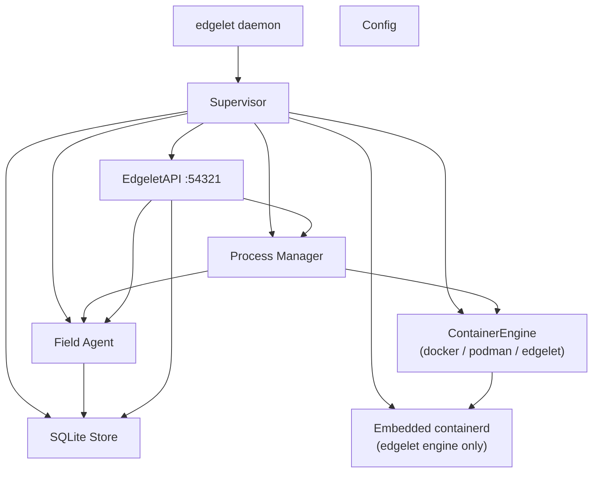
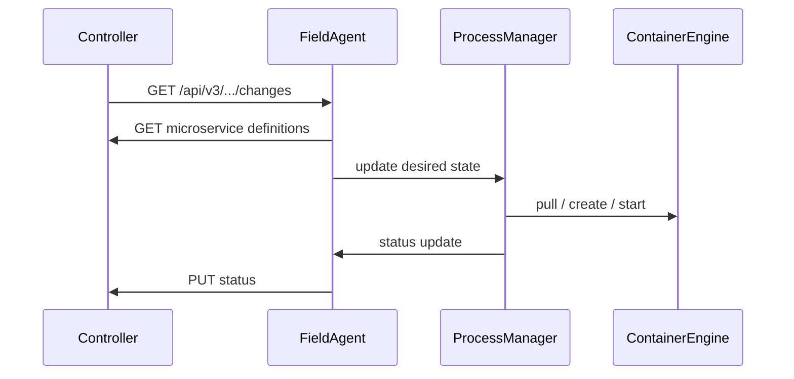

# Edgelet architecture

## Overview

Edgelet is the edge agent for the ioFog platform. A single multicall binary (`edgelet`) provides the operator CLI and the supervisor daemon (`edgelet daemon`). The supervisor maintains bidirectional sync with the ioFog Controller, reconciles desired microservice state against a pluggable container engine, and exposes the on-device **EdgeletAPI** for local administration.

All container operations go through a `ContainerEngine` interface (`docker`, `podman`, or embedded `edgelet` containerd).

---

## Directory layout

```
.
├── cmd/edgelet/              # Multicall entry (CLI + daemon + containerd child)
├── internal/
│   ├── auth/                 # JWT, TLS, EdgeletAPI PKI and token lifecycle
│   ├── buildmeta/            # Compile-time flavor (lite | full)
│   ├── config/               # YAML config load/save, SIGHUP reload
│   ├── edgeletapi/           # EdgeletAPI HTTP/WebSocket server (:54321)
│   ├── fieldagent/           # Controller communication and sync
│   ├── processmanager/       # Container reconciliation loop
│   ├── statusreporter/       # Status aggregation
│   ├── store/                # SQLite persistence
│   ├── supervisor/           # Root orchestrator — module start/stop order
│   └── volumemount/          # Secret / ConfigMap volume lifecycle
└── pkg/
    ├── containerd/           # In-process containerd service (edgelet engine)
    └── engine/
        ├── engine.go         # ContainerEngine interface
        ├── docker/           # Docker adapter
        ├── podman/           # Podman adapter
        └── edgelet/          # Embedded containerd adapter (full flavor)
```

---

## Module diagram



---

## EdgeletAPI

The **EdgeletAPI** is the daemon↔CLI HTTPS/WebSocket surface on the edge node. It is **not** the Controller REST API.

| Item | Value |
|------|--------|
| Port | `54321` (TLS) |
| Route prefix | `/v1/...` |
| CLI bearer token | `/etc/edgelet/edgelet-api` |
| TLS trust | `/etc/edgelet/edgeletapi-ca.crt` |
| Unix socket (CLI) | `/run/edgelet/edgelet.sock` |
| JWT `tokenUse` | `edgeletapi` |
| JWT `aud` | `edgelet://edgeletapi/v1` |

Route groups include `/v1/system/*`, `/v1/ms/*`, `/v1/deploy/*`, `/v1/auth/*`, and `/v1/images/*`. Full contract: [edgelet-api-v1-openapi.yaml](edgelet-api-v1-openapi.yaml). Operator guide: [edgelet-api-v1.md](edgelet-api-v1.md).

---

## Controller API

The **Field Agent** talks to the remote ioFog Controller over HTTPS. Controller REST paths remain under `/api/v3/...` (Pot-compatible). This is separate from EdgeletAPI `/v1/...` on localhost.

The field agent polls for configuration changes, loads microservices/registries/volume mounts into SQLite, and posts aggregated status back to the controller.

---

## Container engines

| `containerEngine` | Build flavor | Description |
|-------------------|--------------|-------------|
| `edgelet` | **full** (linux) | Embedded containerd + crun + CNI; no host runtime required |
| `docker` | **lite** | Host Docker socket |
| `podman` | **lite** | Host Podman socket |

See [container-engine.md](container-engine.md) for paths, CNI, and RuntimeClass shims.

---

## DNS (full flavor)

Full-flavor deployments can run an embedded authoritative DNS subsystem for bridge-network service discovery. Operational runbook: [../embedded-dns-runbook.md](../embedded-dns-runbook.md).

Agent DNS name: `edgelet.default.svc.bridge.local`.

---

## Persistence

| Path | Purpose |
|------|---------|
| `/etc/edgelet/config.yaml` | Active configuration |
| `/etc/edgelet/edgelet-api` | EdgeletAPI CLI bearer token (auto-created) |
| `/etc/edgelet/edgeletapi-*.crt/key` | EdgeletAPI TLS PKI |
| `/var/lib/edgelet/` | User data, volume mounts, SQLite |
| `/var/lib/edgelet-containerd/` | Containerd state (edgelet engine) |
| `/var/run/edgelet/` | Runtime sockets and PID files |
| `/var/log/edgelet/` | Rotated daemon logs |

SQLite stores cached microservices, registries, and volume mount records. Schema migrations run idempotently on startup.

---

## Key data flow — microservice deploy


