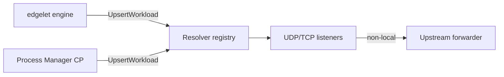

# DNS Resolver

The embedded DNS resolver provides **authoritative bridge DNS** for workloads when using the `edgelet` container engine. It maintains an in-memory workload registry, serves `*.svc.bridge.local`, optional docker/podman compatibility aliases, and forwards non-local queries upstream.

**Code:** `internal/dnsresolver/`

**Operator guide:** [../dns.md](../dns.md)

## Purpose

- Register A/AAAA answers for microservice FQDNs on the bridge network
- Dual scope listeners: managed (`edgelet`) vs local deploy (`iofog-local`)
- Reconcile DNS records from runtime container snapshots
- Rate limiting, forwarding health, metrics snapshot for status/metrics endpoints
- Reserved names: agent, router, NATS, ControlPlane FQDNs

## Dependencies

| Depends on | Reason |
|------------|--------|
| `network` | Bridge gateway IP per scope |
| `config` | Feature flags, intervals, upstreams |

| Used by | Reason |
|---------|--------|
| `pkg/engine/edgelet` | Primary upsert/remove on container lifecycle |
| `processmanager` | ControlPlane workload DNS upsert |
| `pkg/docker` | ExtraHosts / network aliases for docker engine |
| `edgeletapi/handlers` | Status DNS health, Prometheus metrics |

## Architecture

Singleton: `dnsresolver.GetInstance()` → `*Resolver`.

Default zone: **`svc.bridge.local`**.

### Scopes

| Scope | Constant | Typical workloads |
|-------|----------|-------------------|
| Managed | `ScopeManaged` (`edgelet`) | Controller-managed MS |
| Local | `ScopeLocal` (`iofog-local`) | CLI deploy, ControlPlane |

Agent DNS: `edgelet.default.svc.bridge.local`.

## Lifecycle

Resolver starts when edgelet engine initializes (`Engine.Init` wires `GetInstance()`). Background workers:

- **Reconcile loop** — sync registry from runtime snapshot (default 60s)
- **Snapshot/stats** — counters for queries, NXDOMAIN, rate limits
- **Bind retry** — retry listener bind every 5s on failure

Not a Supervisor module with its own `Start()` — owned by engine lifecycle.

## Record updates

`UpsertWorkload(WorkloadRecord)` / `RemoveWorkload(uuid)`:

- Called from edgelet engine on container start/stop
- ControlPlane: `processmanager/controlplane_dns.go`
- Records include application, name, IP, flags (`IsRouter`, `IsNats`, `IsController`)

Helper: `WorkloadBridgeNetworkAliases()` for docker ExtraHosts parity.

## Configuration

Resolver reads config for reconcile interval, rate limits, max request sizes, compat alias enablement, upstream forwarders. See [../dns.md](../dns.md) for operator-facing keys.

## External APIs

| Surface | Role |
|---------|------|
| DNS UDP/TCP on bridge gateway | Workload queries |
| `GET /v1/system/status` | DNS health derived from snapshot |
| `GET /metrics` | DNS counters exported |

## Observability

- Log module: `"EmbeddedDNS"`
- `StatsSnapshot`: query totals, reconcile counts, forwarding degradation flags
- `deriveDNSHealth()` in status handler maps snapshot → health string

## Failure modes

| Symptom | Typical cause |
|---------|----------------|
| NXDOMAIN for valid MS | Reconcile lag; container not registered |
| Forwarding degraded | Upstream DNS unreachable |
| CP names missing | `controlplane_dns` upsert not run |

## Code map

| File | Role |
|------|------|
| `resolver.go` | Core server, registry, listeners |
| `reconcile.go` | Periodic snapshot reconcile |
| `snapshot.go` | Stats snapshot for status/metrics |
| `forwarding.go` | Upstream DNS forward |
| `controlplane.go` | ControlPlane FQDN helpers |
| `ratelimit.go` | Query rate limiting |

Related: [engines.md](engines.md), [processmanager.md](processmanager.md), [../dns.md](../dns.md).
