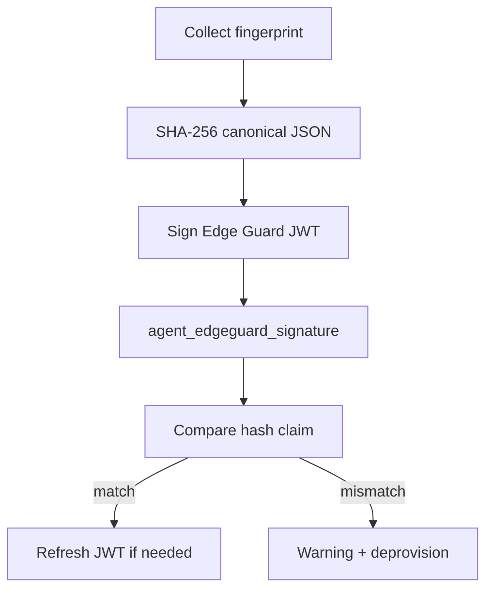

# Edge Guard (runtime module)

Edge Guard is the daemon **hardware attestation loop**. It fingerprints the host, signs a baseline JWT, stores it in SQLite, and on fingerprint drift triggers controller warning + agent deprovision.

**Code:** `internal/edgeguard/`

**Operator guide:** [../edgeguard.md](../edgeguard.md) (configuration, fingerprint sources, mismatch behavior)

## Purpose

- Periodic hardware fingerprint collection (platform-specific)
- Sign stable `hash` claim into Edge Guard JWT
- Compare new fingerprint hash to stored baseline (not full JWT string)
- POST warning + deprovision on real hardware change
- Disable cleanly when `edgeGuardFrequency=0`

## Dependencies

| Depends on | Reason |
|------------|--------|
| `auth` | `GenerateEdgeGuardJWT`, `EdgeGuardHashFromJWT()` |
| `store` | `agent_edgeguard_signature` singleton row |
| `config` | `edgeGuardFrequency`, `iofogUuid`, private key |
| `fieldagent` | Deprovision + status POST on mismatch |
| `statusreporter` | Warning message on supervisor status |

| Used by | Reason |
|---------|--------|
| `supervisor` | Started last in module sequence |

## Lifecycle

### Start

`(*Manager).Start()`:

1. If unprovisioned or no private key → force frequency to 0, delete stored signature if disabled
2. If frequency ≤ 0 → no-op (disabled)
3. Load signature cache from DB
4. Run initial `checkHardwareSignature()`
5. Start `attestationWorker` ticker at `edgeGuardFrequency` seconds

### Stop

Cancel attestation context; stop ticker.

### Config update

`InstanceConfigUpdated()` reschedules attestation interval; cancels prior worker goroutine to avoid leaks.

## Attestation flow

Comparison uses `auth.EdgeGuardHashFromJWT()` on the stored JWT vs newly computed hash — avoids false deprovision when only `iat`/`exp`/`jti` rotate.

## Configuration

| Key | Effect |
|-----|--------|
| `edgeGuardFrequency` | Interval seconds; **0 disables** |
| `iofogUuid` | Must be set (provisioned) for attestation to run |

Unprovisioned agents force frequency to 0 at Field Agent and Edge Guard start.

## Data and persistence

| Table | Content |
|-------|---------|
| `agent_edgeguard_signature` | Latest attestation JWT (`id=1`) |

On disable, signature row is deleted.

## External APIs

No direct HTTP. Side effects:

- Field Agent deprovision path
- Controller status POST with warning
- Clears supervisor warning after successful re-provision (Field Agent)

## Observability

- Log module name: `"Edge Guard Manager"`
- Not in `modulesStatus[]` fixed array; warning via `SupervisorStatus.warningMessage`

## Failure modes

| Symptom | Typical cause |
|---------|----------------|
| Unexpected deprovision | Hardware change; VM migration; fingerprint source drift |
| Attestation skipped | Frequency 0 or unprovisioned |
| Start error | DB signature load failure on enabled config |

Platform fingerprint collection: `fingerprint_linux.go`, `fingerprint_darwin.go`, etc.

## Code map

| File | Role |
|------|------|
| `manager.go` | Start/stop, attestation worker, deprovision trigger |
| `fingerprint_*.go` | Platform fingerprint collectors |
| `fingerprint_types.go`, `fingerprint_diff.go` | Canonical payload + diff |

Related: [auth.md](auth.md), [fieldagent.md](fieldagent.md), [store.md](store.md), [../edgeguard.md](../edgeguard.md).
